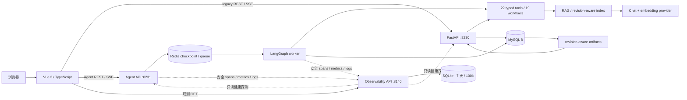

# EzllmTest

> [Verified] 当前仓库树为 Iteration 6 最终基线：保留 19 个工作流、22 个 Agent 工具、REST/SSE/MCP、MySQL/Redis 持久化与安全边界，并采用三文件本地运行及中文观测后台。范围、验证和限制见 [Iteration 6 收口报告](docs/iteration-6-closeout.md)；历史结论见 [验证历史](docs/validation-history.md)，不代表当前复跑或正式生产就绪。

一个面向软件测试团队的本地 AI 测试工作台：从项目资料上传开始，经业务分析、测试计划和推荐菜单，继续生成单元、集成、API、UI、数据库、功能、非功能与验收测试成果。

历史基线记录了 Iteration 1–4 的完成结果。Iteration 3 统一了应用壳、设计系统、项目恢复和八类测试页，并通过真实 `GLM-4.7`、`embedding-3` 与本地 MySQL 完成一条脱敏代表性旅程；Iteration 4 在不替换原有确定性 workflow 的前提下，新增了可规划、可审批、可恢复、可评测、可观测的 LangGraph 单 Agent 编排层，并通过完整离线验收与隔离的真实模型合成项目 E2E。Iteration 5 的 Aspect 1–7 已形成当前工程基线，Aspect 8 已执行但未完成（Blocked）；真实 gate 状态与未完成限制见 [`docs/development/iteration-5/closeout.md`](docs/development/iteration-5/closeout.md)。

> 仓库为私有项目。私有可见性不是凭证保险箱：任何 API Key、数据库密码、真实项目 ID、客户资料和运行时产物都不得提交。

## 项目背景

传统测试设计往往分散在需求文档、设计文档、个人经验和多个工具之间。EzllmTest 将这些输入组织为可恢复的工作流：先理解业务和技术边界，再形成测试计划与推荐类型，最后在同一项目上下文中逐步生成可审阅的测试分析和用例。

平台强调“可控生成”而不是页面加载即调用模型：每次付费操作都由用户显式触发，流式显示进度，可取消；结果只有在完整完成后才进入保存边界，失败或取消不会覆盖上一份有效资产。

## 适用场景

- 新项目进入测试阶段，需要快速形成业务摘要、测试范围和测试计划。
- 需求、设计和测试知识分散，需要借助 RAG 建立同一项目上下文。
- 测试负责人希望按单元、API、UI 等领域分阶段生成并复核结果。
- 团队需要区分“项目内可恢复资产”和“仅当前页面保留”的临时用例。
- 本地或内网研发环境需要可审计的模型选择、Token、缓存、取消、失败和 stale 反馈。

## 核心能力

- **19 个可恢复流式工作流**：1 个项目分析工作流，以及八类测试工作区中的 18 个分析/用例工作流。
- **REST + SSE**：项目恢复与状态读取使用 REST，模型阶段通过 SSE 发送 meta、progress、reasoning、answer、usage、artifact、completed 或 error。
- **revision-aware cache**：缓存键包含资料版本、提示词版本、模型和业务选择；相同上下文可恢复 artifact，资料变化后旧结果进入 stale。
- **延迟保存与失败回滚**：只有完整结果通过结构校验后才原子保存；取消、解析失败或持久化失败保留上一份有效结果。
- **显式生成与取消**：页面首次进入只读取状态，不自动调用 chat 或 embedding；运行中可取消并保留 partial output。
- **清晰的保留边界**：五类 final 为 session-only；UI、数据库和验收 final 为 persisted artifact。
- **可访问的响应式工作台**：覆盖 320px reflow、移动抽屉、键盘焦点、reduced-motion、状态 live region 和长文本安全换行。
- **受控 Agent 编排**：LangGraph 单 Agent 只选择 22 个类型化工具中的受控能力；项目作用域由可信宿主注入，付费、持久化与 regenerate 动作必须人工审批。
- **持久执行与恢复**：Redis 保存有 TTL 的 checkpoint、租约、幂等、取消和事件重放；MySQL 仍是项目、revision 与有效 artifact 的长期真源。
- **工作台与 MCP**：独立 Agent API、worker 和 `/agent` 工作台展示结构化计划、审批、证据、预算、恢复与 trace；loopback MCP 默认只能执行三个只读工具。
- **本地安全观测**：保留 OpenTelemetry 埋点，使用 loopback HTTP 写入 7 天/100,000 行上限的 SQLite；中文 `/observability` 展示健康、指标、安全日志和 Trace，不使用外部 Collector/Prometheus/Tempo/Grafana/LangSmith tracing。
- **历史真实模型合成验收**：修复后的 planner 结构化输出为 `6/6`，真实 RAG 为 `3/3`；隔离的 `ui_info → ui_case` 旅程经过两次人工审批后完成，并实际使用 chat、embedding、RAG 与 artifact 服务。

## 关键界面

以下截图是 Iteration 3 的虚构“Aurora 任务协作平台”代表性旅程，使用真实 `GLM-4.7` 与 `embedding-3`；它们不是 Agent 真实模型验收证据。reasoning 保持折叠，项目 ID 已遮盖，截图不包含请求 payload、凭证或真实业务文档。

### 流式计划与保存结果


运行态同时表达当前阶段、真实进度、模型、取消入口和下游锁定状态。


完整成功后，业务摘要、计划和推荐菜单作为同一 revision 的项目资产保存。

### 八类测试工作台


菜单始终展示八类测试；推荐、可进入、stale、锁定和已有结果互不混淆。


qualified name 与来源共同区分同名目标；阶段结果与生成时选择绑定，切换目标不会错误展示上一份分析。


UI、数据库和验收 final 会持久化；页面可以仅隐藏当前显示，而不会删除服务器结果。


1024px 以下使用可关闭、可键盘操作的覆盖式导航抽屉，正文不产生页面级横向滚动。

<details>
<summary>展开查看入口、项目资料和 session-only 用例</summary>


</details>

截图文件、视口、operation、模型和脱敏方式见 [`docs/images/readme/manifest.json`](docs/images/readme/manifest.json)。

## 技术栈

| 层次     | 技术                                                                                                 |
| -------- | ---------------------------------------------------------------------------------------------------- |
| Web      | Vue、TypeScript、Vue Router、Element Plus、Vite                                                      |
| API      | Python、FastAPI、Pydantic、Uvicorn；legacy API 与独立 Agent API                                      |
| Agent    | LangGraph 单 Agent、严格 JSON checkpoint、自定义 Redis saver、HITL                                   |
| 工具协议 | 19-workflow catalog、22 个类型化工具、loopback MCP 2                                                 |
| 数据     | MySQL、Redis、SQLAlchemy、PyMySQL                                                                    |
| LLM      | LangChain Core、LangChain OpenAI、OpenAI-compatible providers                                        |
| 检索     | RAG、请求级内存向量索引、智谱 `embedding-3`                                                          |
| 流式协议 | REST + Server-Sent Events（SSE）                                                                     |
| 文档     | pypdf、docx2txt、Markdown/纯文本读取                                                                 |
| 可观测性 | OpenTelemetry SDK、本地 HTTP exporter、FastAPI 观测 API、SQLite、中文 Vue UI |
| 本地运行 | 现有 Conda / Node、外部 MySQL / Redis、五模块显式配置启动器 |
| 验证证据 | 历史结果见验证历史；当前观测实现已通过离线、production build、五模块 readiness 与浏览器门禁 |

聊天模型注册表：

| Provider 参数 | 前端显示            | 后端公共标签    | API Key 变量        |
| ------------- | ------------------- | --------------- | ------------------- |
| `zhipu`       | `glm-4.7`           | `GLM-4.7`       | `ZHIPU_API_KEY`     |
| `alibaba`     | `qwen3.5-plus`      | `通义千问`      | `DASHSCOPE_API_KEY` |
| `deepseek`    | `deepseek-v4-flash` | `DeepSeek`      | `DEEPSEEK_API_KEY`  |
| `moonshot`    | `kimi-k3`           | `Moonshot Kimi` | `MOONSHOT_API_KEY`  |

RAG 当前统一使用智谱 `embedding-3`；即使聊天模型选择其他 provider，也需要配置智谱 embedding。

## 系统架构



legacy 模型输出的生命周期仍是：显式操作 → REST/SSE 请求 → 分阶段预算与结构校验 → 延迟保存 → workflow status 恢复。Agent 在其上增加观察 → 结构化计划 → 风险审批 → 工具执行 → 验证/恢复；工具在进程内调用应用服务层，不通过 HTTP 或 MCP 自调。页面路由守卫只服从服务器 lifecycle、allowed routes 和 stale 信息。

### 工作流与保留策略

| 工作区   | 阶段                                                     | final 保留方式                       |
| -------- | -------------------------------------------------------- | ------------------------------------ |
| 项目规划 | `project_analysis`                                       | persisted artifact                   |
| 单元     | `unit_menu → unit_info → unit_case`                      | `unit_case` session-only             |
| 集成     | `integration_menu → integration_info → integration_case` | `integration_case` session-only      |
| API      | `api_info → api_case`                                    | `api_case` session-only              |
| UI       | `ui_info → ui_case`                                      | `ui_case` persisted artifact         |
| 数据库   | `db_info → db_case`                                      | `db_case` persisted artifact         |
| 功能     | `functional_info → functional_case`                      | `functional_case` session-only       |
| 非功能   | `nonfunctional_info → nonfunctional_case`                | `nonfunctional_case` session-only    |
| 验收     | `acceptance_info → acceptance_case`                      | `acceptance_case` persisted artifact |

所有 preliminary analysis 都持久化。五类 session-only final 只在当前页面会话保存正文；换标签会话后不会被当成服务器 artifact 恢复。

## 仓库结构

```text
EzllmTest/
├─ backend/                     # FastAPI / Agent 产品源码
│  ├─ app/                     # legacy API、Agent API、worker、MCP
│  ├─ service/                 # canonical domain、workflow、工具与兼容 facade
│  ├─ infrastructure/          # 持久化、队列与模型等产品适配层
│  ├─ llm/                     # provider、预算、RAG 与结构化输出
│  └─ dao/                     # SQLAlchemy 数据访问
├─ frontend/                    # Vue 3 / TypeScript / Vite
│  └─ src/
│     ├─ app/                  # router 与应用壳
│     ├─ features/             # Agent 与八类测试生成功能
│     ├─ shared/               # 共享组件、composable 与样式
│     ├─ assets/               # 产品静态资源
│     └─ views/                # 保留的兼容入口
├─ observability/               # 本地观测配置说明与 ignored SQLite data
├─ infrastructure/
│  ├─ database/schema.sql      # 原始结构文件，仅供审核后空库初始化
│  └─ runtime/                 # 当前运行拓扑与精确前端公开配置适配
├─ scripts/modular_runtime.py  # 显式本地启动、状态、就绪与归属校验停机
├─ ops/                         # 保留的兼容包装入口与历史契约，不是新配置来源
├─ docs/                        # 产品文档、长期收口、验证历史与图片
├─ .env.example                 # 旧位置迁移说明，不含运行变量
└─ README.md
```

[Verified] 产品公共 Python 模块名与已有 Vue 路由保持不变，并新增无需项目 ID 的 `/observability`。仓库自测、Eval/Acceptance/Benchmark、CI、Docker/Compose 与外部观测配置已从当前 V6 移除；产品中名称含 Test 或 acceptance 的生成能力仍保留。少量空旧目录和受保护的既有缓存不作为可执行验证设施，也不自动清理。

## 本地运行

### 环境与当前边界

[Verified] 本次使用已有 Conda Python 3.11.15、Node v24.18.0、npm 11.16.0、MySQL 和本地 Redis 8.2.9，不使用 WSL、Docker 或容器。当前依赖环境没有被升级；Python/npm manifests 与 locks 随产品原样保留，包含尚未收敛的旧测试依赖和版本差异，不能视为重新求解后的产品最小依赖集。

[Protected] 新启动方式仅使用用户本机填写的 backend/frontend/observability 三份真实 `.env`，全部显式指定、被 Git 忽略。不自动复制旧凭据、不读取 V2 补齐缺项，不改 Windows 用户/系统环境。已有旧配置、上传、数据库、Redis 及日志保留原样。

[Verified] 当前五模块运行拓扑使用 8180/8230/8231/8140；旧显式兼容模式仍保留 8080/8130/8131 与本地 8140。配置值只进入对应子进程，不回写文件或 Windows 环境。

[Verified] 三文件配置解析、五模块假进程、API/SQLite/exporter、Vue 静态门禁和系统临时 production build 已通过。用户在本机完成 ignored 配置后，脱敏 config-check、MySQL/Redis preflight、五模块 readiness、安全 Trace 查询和中文页面检查也均通过。真实配置值未进入仓库或文档。

| 服务 | 本次地址 | 归属 |
| --- | --- | --- |
| 本地观测 API | `http://127.0.0.1:8140` | 当前 runner |
| 前端 | `http://127.0.0.1:8180` | 当前 runner |
| legacy API | `http://127.0.0.1:8230` | 当前 runner |
| Agent API | `http://127.0.0.1:8231` | 当前 runner |
| Agent worker | 无 HTTP 端口 | 当前 runner |
| MySQL / Redis | 显式配置中的本地连接 | 外部管理，不由 runner 启停 |

### 显式配置启动

先在本机按三个模块的 `.env.example` 填写对应 `.env`。后端必须保留当前 V6 的数据库连接、Redis 数据库及 namespace；密钥不发送到聊天或前端。以下纯配置检查不探测数据库/Redis、不启动服务：

```powershell
& 'D:\tool\anaconda3\envs\ezllmtest\python.exe' -B 'D:\codex\EzllmTest_v6\scripts\modular_runtime.py' config-check --backend-env-file 'D:\codex\EzllmTest_v6\backend\.env' --frontend-env-file 'D:\codex\EzllmTest_v6\frontend\.env' --observability-env-file 'D:\codex\EzllmTest_v6\observability\.env' --format json
```

维护窗口前先确认没有生成任务，再按 [运行指南](docs/operations/modular-runtime.md) 执行 `preflight`、归属校验停机及 `start`。预检仅使用 MySQL `SELECT 1`/表名元数据和 Redis `PING`；启动后 worker 会维护运行心跳。启动器不初始化数据库、不安装依赖、不扫描项目或调用模型。已有前端依赖保持原样，通过 Node/Vite 启动，不重新执行 npm。

[Verified] `--env-file`、`--model-env-file`、`--moonshot-model` 和 `--frontend-port` 仅属于明确选择的弃用兼容模式，不得与三文件模式混用，也没有自动回退。模型专用旧来源仍只保留固定 17 个字段，不追随 `_FILE`；新后端主配置支持五项明确允许的 `_FILE`，与直接赋值互斥。模型 key 可留空至选用该 provider 时；配置通过不证明账户或额度可用。

[Verified] 新模式在 backend 配置中明确指定 `MOONSHOT_CHAT_MODEL=kimi-k3`，不再依赖旧模型覆盖参数。兼容模式的显式覆盖行为保留。K2.5 停用的历史依据见 [Kimi 官方模型列表](https://platform.kimi.ai/docs/models)；未在本次调用平台验证。

[Verified] 最终测试计划中，DeepSeek 使用 `high / max_tokens=16384`，K3 保持 `high / max_completion_tokens=8192`。DeepSeek 的 high 是 low/high/max 三档中的中档，medium 也映射到 high；不是独立的更低强度。额度由思考与正文共用，不保证思考长度，也不是整个工作流或输入费用上限。K3 不发送旧 thinking 参数；摘要阶段仍为 K3 low、DeepSeek off。达到上限、空正文或中断均不会保存为成功结果。保存契约和新 DeepSeek 缓存身份已经直接经过实际工作流/保存函数的无网络模拟验证，没有重放真实项目或付费调用。更大的 DeepSeek 输出可能增加费用与延迟。详见 [运行说明](docs/operations/modular-runtime.md)。

[Verified] 八类测试（单元、集成、API、UI、数据库、功能、非功能、验收）的共享最终用例上限现为 **32768**，相关十个分析操作的最终上限为 **16384**，适用于四个已注册模型。小步骤预算不扩大；DeepSeek 仍启用中档 high 思考，K3 通用工作流仍为 low，以上独立测试计划设置不变。请求、SSE 预算提示及上下文预留共用同一 profile；既有有效缓存和 session-only 保存规则保持不变。新额度只影响后续生成，不自动重试、续写或覆盖旧结果；可能增加单次耗时与费用，也仍可能截断。

`start` 返回 run ID。用同一 Python 调用 `status --run-id <run-id>`、`ready --run-id <run-id>`；需要停止时仅使用 `stop --run-id <run-id>` 处理归属验证通过的本轮进程。完整参数、配置隔离和安全停机协议见 [分模块运行](docs/operations/modular-runtime.md)。

### 配置名称与数据库结构

[Verified] 配置字段由 [纯配置模块](backend/infrastructure/runtime_config.py) 定义；[后端示例](backend/.env.example)、[前端示例](frontend/.env.example) 和 [观测示例](observability/.env.example) 只作说明，不充当 schema。当前拓扑位于 [运行契约](infrastructure/runtime/modular-runtime-contract.json)。Python/npm manifest、lock、格式化和历史版本治理文件不是应用运行配置。

| 配置名称 | 作用与边界 |
| --- | --- |
| `DATABASE_URL` | 专用 MySQL 连接；敏感，只给后端 |
| `AGENT_REDIS_URL` / `AGENT_REDIS_PREFIX` | Agent 状态、队列与 namespace；不进入浏览器 |
| `BACKEND_HOST` / `BACKEND_PORT` | loopback legacy API 与独立端口 |
| `AGENT_API_PORT` | loopback Agent API 端口 |
| `CORS_ORIGINS` | 允许的前端 origin |
| `FRONTEND_PORT` 与三个 `VUE_APP_*_BASE_URL` | 前端端口只给启动器；浏览器只接收 legacy、Agent、本地观测三个明确允许的 loopback URL |
| `OBSERVABILITY_*` | 8140、ignored SQLite 路径、保留/行数门禁与前端 CORS；仅给观测服务 |
| `AGENT_TELEMETRY_*` / `AGENT_OTEL_*` | 启用本地安全 exporter；外部 endpoint/tracing 字段被拒绝 |
| provider key、模型和 embedding 配置 | 保留现有字段名；新模式仅从 backend 文件注入后端，不执行 provider 验证请求 |
| `AGENT_FOCUSED_MAX_*_TOKENS` / `AGENT_STANDARD_MAX_*_TOKENS` | 新运行的独立输入/输出总限额；不随 workflow 单次额度联动 |

[Verified] Agent 修复后的规划和执行使用同一选定模型，规划仍限制 4096 Token 和严格 JSON；K3 规划 low，支持关闭思考的其他模型保持关闭。新运行的聚焦输入/输出总额度默认 768000/393216，标准 2048000/1048576；步数、时间和调用次数未扩大。旧运行展示与执行均使用创建时保存的预算，不因配置更新而重算；合成成本单位不是货币金额。当前三文件运行已加载这些修复。

[Protected] [schema.sql](infrastructure/database/schema.sql) 保持原始内容，其中含 `DROP TABLE IF EXISTS`。不得直接导入已有用户数据库。本次由单独获授权的初始化流程在新库建立七表，只给专用应用账户必要权限；配置值与数据不写进文档。

## 历史验证与当前验证范围

[Verified] [验证历史](docs/validation-history.md) 区分冻结 fixture、跟踪叙述、仓库外未审计结果、Blocked 与 Protected，并保留原始方法、数值和限制。移除的验证代码和容器设施可从[不可变历史快照](https://github.com/Jaily16/EzllmTest/tree/5cf1effb32a8efcd34902df05d27442f3586dc1c)恢复；旧执行说明见[快照 README](https://github.com/Jaily16/EzllmTest/blob/5cf1effb32a8efcd34902df05d27442f3586dc1c/README.md)，不适用于当前 V6。

[Verified] Iteration 6 的本地验证包括产品内容保留、Python AST、19 workflows/22 tools/八类页面、配置隔离、四模型合成规划、预算/持久化保护、本地观测的严格 schema、SQLite 边界、API/CORS、五进程 token 隔离，以及 902 个 Python 函数和 561 个前端函数节点的注释覆盖/等价门禁、Vue type/lint/format 和 production build。完整范围见 [Iteration 6 收口报告](docs/iteration-6-closeout.md)。

[Candidate] 2026-09-07 另行授权的最小真实烟测使用合成项目完成一次 GLM 分析保存/恢复、一次 2048 维有限 `embedding-3`，以及一次 legacy RAG 超时修复后的唯一成功重试。它没有保存项目标识、生成正文或向量，也不能外推为客户项目质量。

[Missing] 本次未复跑 pytest、Eval、Acceptance 或 Benchmark，也未执行压力/容量、持续负载、完整浏览器项目 E2E 或完整 Agent E2E。production build、readiness、观测页面与有限真实烟测均不消除历史 Blocked，也不构成正式生产就绪证明。

## 安全与费用

- **凭证**：真实 `.env`、PAT、API Key、数据库密码和 tracing token 永远不得提交；一旦疑似泄露，应立即在供应商后台撤销或轮换。
- **私有仓库**：保持 GitHub `PRIVATE`，但仍按最小披露原则审阅 README、图片、Git 历史和 ignored/untracked 文件。
- **项目 ID**：完整项目 ID 相当于本地恢复入口。公开截图必须遮盖，日志和交付消息不得输出。
- **模型费用**：页面加载不会自动调用模型；生成应先核对 provider、余额和预期调用范围。Iteration 6 曾在逐项授权下执行有限的合成项目模型/embedding/RAG 烟测；最终收口验证未再触发付费调用。
- **数据库备份**：仓库 SQL 面向空库初始化，包含 `DROP TABLE IF EXISTS`。不要直接覆盖已有数据库；升级前必须备份并由数据库管理员审核 DDL。
- **业务资料**：`backend/static/projects/`、向量索引、上传源文档、截图中间文件、`dist` 与缓存均受 ignore/发布审计保护。
- **reasoning**：界面 reasoning 仅当前会话展示且默认折叠，不持久化；公开材料不得复制模型内部推理、请求 payload 或 provider 异常详情。
- **Agent reasoning**：legacy SSE 的 `reasoning_delta` 为受保护兼容字段；Agent checkpoint、API、SSE、MCP、日志和 trace 均不保存或展示 chain-of-thought。

## 迁移与兼容性

- 旧 `langchain.chains`、retriever 与 storage 调用已迁移到 LangChain Core runnable/LCEL。
- Pydantic v1 兼容层与 `.dict()` 已迁移到 Pydantic 2。
- SQLAlchemy 声明模型迁移到 2.x，同时保留原六张表、列名和主键，并增加 workflow artifact 表。
- RAG 使用请求级内存向量库与进程内 revision-aware 复用，避免不同项目共享全局检索数据。
- FastAPI 路径、请求字段、`{status, reason, data}` 响应信封和现有 REST/SSE wire format 保持兼容。
- `infrastructure/database/schema.sql` 面向审核后的空库初始化；本次没有对既有用户数据库执行迁移。

## 迭代文档

- Iteration 1 完成报告：[`docs/history/iteration-1/iteration-1-closeout.md`](docs/history/iteration-1/iteration-1-closeout.md)
- Iteration 1 任务与过程：[`docs/history/iteration-1/iteration-1-tasks.md`](docs/history/iteration-1/iteration-1-tasks.md)、[`docs/history/iteration-development-log.md`](docs/history/iteration-development-log.md)
- Iteration 2 任务：[`docs/history/iteration-2/iteration-2-tasks.md`](docs/history/iteration-2/iteration-2-tasks.md)
- Iteration 2 完成报告：[`docs/history/iteration-2/iteration-2-closeout.md`](docs/history/iteration-2/iteration-2-closeout.md)
- Iteration 2 Token 基线：[`docs/history/iteration-2/iteration-2-token-baseline.md`](docs/history/iteration-2/iteration-2-token-baseline.md)
- Iteration 2 开发日志：[`docs/history/iteration-2/iteration-2-development-log.md`](docs/history/iteration-2/iteration-2-development-log.md)
- Iteration 3 路线图：[`docs/history/iteration-3/iteration-3-overview.md`](docs/history/iteration-3/iteration-3-overview.md)
- Iteration 3 完成报告：[`docs/history/iteration-3/iteration-3-closeout.md`](docs/history/iteration-3/iteration-3-closeout.md)
- Iteration 3 开发日志：[`docs/history/iteration-3/iteration-3-development-log.md`](docs/history/iteration-3/iteration-3-development-log.md)
- Iteration 3 设计系统：[`docs/history/iteration-3/iteration-3-design-system.md`](docs/history/iteration-3/iteration-3-design-system.md)
- Iteration 3 测试工作区：[`docs/history/iteration-3/iteration-3-test-workspaces.md`](docs/history/iteration-3/iteration-3-test-workspaces.md)
- 新对话提示词：[`docs/history/iteration-3/iteration-3-prompts.md`](docs/history/iteration-3/iteration-3-prompts.md)
- Iteration 4 路线图（Aspect 1–8 已完成验收）：[`docs/history/iteration-4/iteration-4-overview.md`](docs/history/iteration-4/iteration-4-overview.md)
- Iteration 4 新对话提示词：[`docs/history/iteration-4/iteration-4-prompts.md`](docs/history/iteration-4/iteration-4-prompts.md)
- Iteration 4 完成报告：[`docs/history/iteration-4/iteration-4-closeout.md`](docs/history/iteration-4/iteration-4-closeout.md)
- Iteration 4 真实模型验收：[`docs/history/iteration-4/iteration-4-live-model-acceptance.md`](docs/history/iteration-4/iteration-4-live-model-acceptance.md)
- Iteration 4 开发日志：[`docs/history/iteration-4/iteration-4-development-log.md`](docs/history/iteration-4/iteration-4-development-log.md)
- Iteration 5 工程治理路线图（历史记录）：[`docs/development/iteration-5/overview.md`](docs/development/iteration-5/overview.md)
- Iteration 5 新对话提示词：[`docs/development/iteration-5/prompts.md`](docs/development/iteration-5/prompts.md)
- 保留的历史版本契约与升级/回滚说明：[`docs/versions.md`](docs/versions.md)
- Aspect 3 工程规范与中文说明：[`docs/development/iteration-5/style-guide.md`](docs/development/iteration-5/style-guide.md)
- Aspect 4 后端领域迁移映射：[`docs/architecture/backend-domain-migration.md`](docs/architecture/backend-domain-migration.md)
- Iteration 6 最终收口：[`docs/iteration-6-closeout.md`](docs/iteration-6-closeout.md)
- 跨迭代验证证据索引：[`docs/validation-history.md`](docs/validation-history.md)

## 已知限制

- Iteration 4 的真实模型证据只覆盖版本化合成目标、合成文档和隔离的 `ui_info → ui_case` 旅程；尚未验证真实客户项目、生产负载或用户 MySQL，不应外推为生产质量结论。
- RAG 索引是进程内缓存，容量、TTL、后端重启或多 worker 会触发各自重建。
- Agent thread/checkpoint 与 session-only evidence 默认保留 7 天；Redis 数据丢失会使旧 thread 不可恢复，但不影响 MySQL 中的有效 artifact。
- 历史浏览器与静态/SFC 验收只证明相应历史版本；当前 V6 的一次合成项目分析、embedding 和 RAG 烟测仍不是完整浏览器项目 E2E 或 Agent E2E。
- 当前 V6 不包含旧 GitHub Actions 门禁与容器交付设施；不会把远程 main 的历史状态当作 V6 验证结果。
- 历史 `v0.1.0-preview.1` 的 Docker full-stack、容器内 Acceptance 与双拓扑 parity 仍为 Blocked；本次没有处理这些历史限制。详见[源码预发布说明](docs/development/iteration-5/source-preview-v0.1.0-preview.1.md)和[历史 closeout](docs/development/iteration-5/closeout.md)。
- 保留公共兼容 facade 不代表已穷尽仓库外消费者；目录改名对外部硬编码脚本的影响尚不能从仓库证明。

## 常见问题

- `/health` 显示 `database: error`：检查 MySQL 服务、应用用户权限和 `DATABASE_URL`。
- 提示模型 key 未配置：新模式检查 `--backend-env-file` 选中的配置；旧模式才检查 `--env-file` / `--model-env-file`。修改后需受控重启，不要发送密钥。`/health` 的 `llm_configured` 只检查智谱，不能推断全部 provider 可用。
- 前端无法访问后端：确认后端端口、`VUE_APP_API_BASE_URL` 和 `CORS_ORIGINS` 使用同一前端 origin。
- 此 runner 不自动寻找任何 `.env`；只读取显式传入的文件。更改配置仅对新进程生效，重启前先确认任务空闲及对应 run ID 的归属。
- Moonshot 返回 401：确认 Key 与 `.cn`/`.ai` 平台地址匹配。
