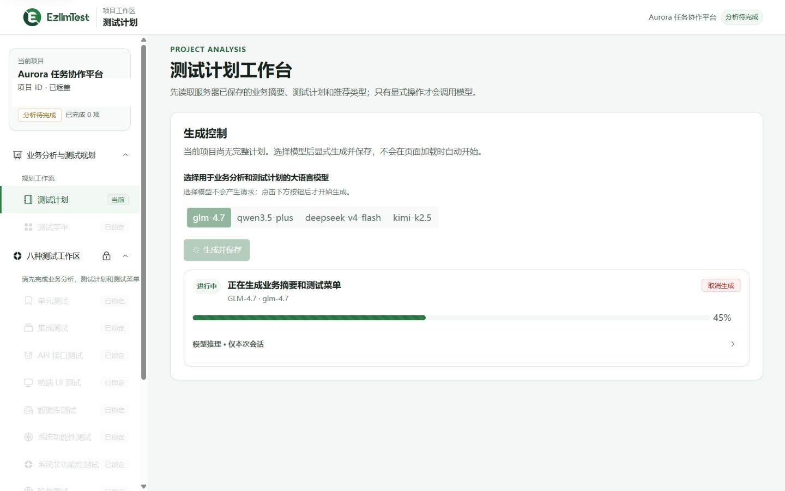
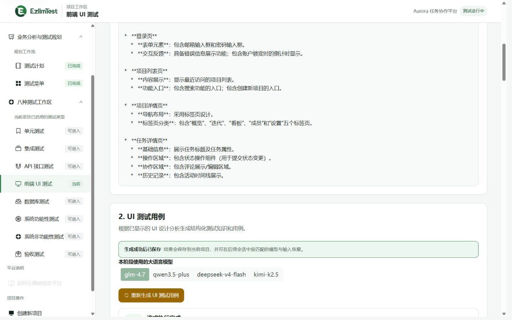
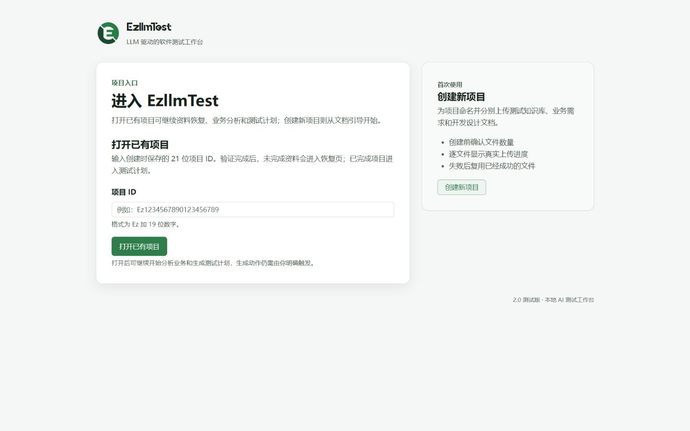
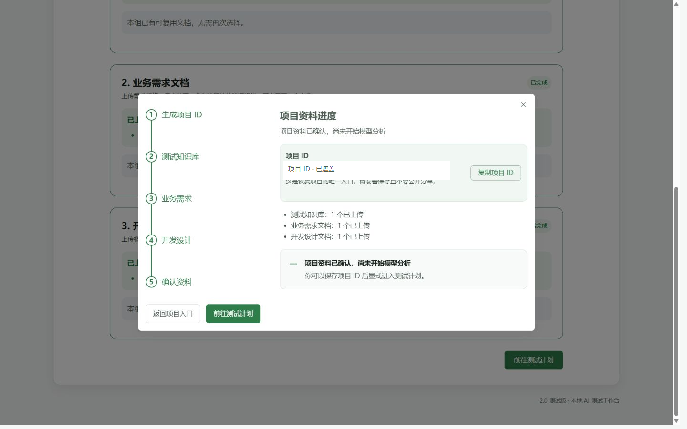
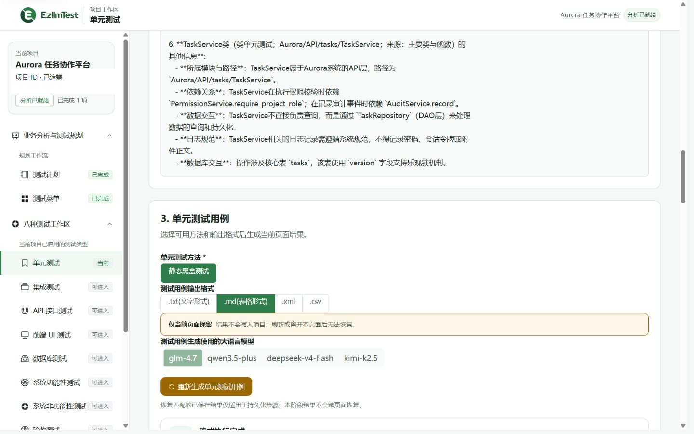
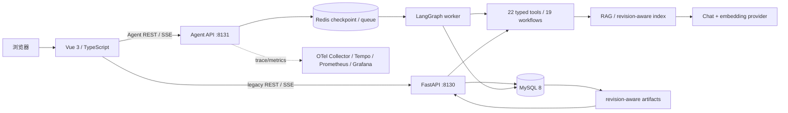

# EzllmTest

[](https://github.com/Jaily16/EzllmTest/actions/workflows/iteration4-offline.yml)

一个面向软件测试团队的本地 AI 测试工作台：从项目资料上传开始，经业务分析、测试计划和推荐菜单，继续生成单元、集成、API、UI、数据库、功能、非功能与验收测试成果。

当前仓库已完成 Iteration 1–4。Iteration 3 统一了应用壳、设计系统、项目恢复和八类测试页，并通过真实 `GLM-4.7`、`embedding-3` 与本地 MySQL 完成一条脱敏代表性旅程；Iteration 4 在不替换原有确定性 workflow 的前提下，新增了可规划、可审批、可恢复、可评测、可观测的 LangGraph 单 Agent 编排层，并通过完整离线验收与隔离的真实模型合成项目 E2E。Iteration 5 的 Aspect 1–7 已形成当前工程基线，Aspect 8 已执行但未完成（Blocked）；真实 gate 状态与未完成限制见 [`docs/development/iteration-5/closeout.md`](docs/development/iteration-5/closeout.md)。

> 仓库为私有项目。私有可见性不是凭证保险箱：任何 API Key、数据库密码、真实项目 ID、客户资料和运行时产物都不得提交。

## 项目背景

传统测试设计往往分散在需求文档、设计文档、个人经验和多个工具之间。EzllmTest 将这些输入组织为可恢复的工作流：先理解业务和技术边界，再形成测试计划与推荐类型，最后在同一项目上下文中逐步生成可审阅的测试分析和用例。

平台强调“可控生成”而不是页面加载即调用模型：每次付费操作都由用户显式触发，流式显示进度，可取消；结果只有在完整完成后才进入保存边界，失败或取消不会覆盖上一份有效资产。

## 适用场景

- 新项目进入测试阶段，需要快速形成业务摘要、测试范围和测试计划。
- 需求、设计和测试知识分散，需要借助 RAG 建立同一项目上下文。
- 测试负责人希望按单元、API、UI 等领域分阶段生成并复核结果。
- 团队需要区分“项目内可恢复资产”和“仅当前页面保留”的临时用例。
- 本地或内网研发环境需要可审计的模型选择、Token、缓存、取消、失败和 stale 反馈。

## 核心能力

- **19 个可恢复流式工作流**：1 个项目分析工作流，以及八类测试工作区中的 18 个分析/用例工作流。
- **REST + SSE**：项目恢复与状态读取使用 REST，模型阶段通过 SSE 发送 meta、progress、reasoning、answer、usage、artifact、completed 或 error。
- **revision-aware cache**：缓存键包含资料版本、提示词版本、模型和业务选择；相同上下文可恢复 artifact，资料变化后旧结果进入 stale。
- **延迟保存与失败回滚**：只有完整结果通过结构校验后才原子保存；取消、解析失败或持久化失败保留上一份有效结果。
- **显式生成与取消**：页面首次进入只读取状态，不自动调用 chat 或 embedding；运行中可取消并保留 partial output。
- **清晰的保留边界**：五类 final 为 session-only；UI、数据库和验收 final 为 persisted artifact。
- **可访问的响应式工作台**：覆盖 320px reflow、移动抽屉、键盘焦点、reduced-motion、状态 live region 和长文本安全换行。
- **离线回归夹具**：Python 标准库 loopback fixture 可验证缓存、stale、取消、结构化错误、持久化失败和 onboarding，不连接真实模型或数据库。
- **受控 Agent 编排**：LangGraph 单 Agent 只选择 22 个类型化工具中的受控能力；项目作用域由可信宿主注入，付费、持久化与 regenerate 动作必须人工审批。
- **持久执行与恢复**：Redis 保存有 TTL 的 checkpoint、租约、幂等、取消和事件重放；MySQL 仍是项目、revision 与有效 artifact 的长期真源。
- **工作台与 MCP**：独立 Agent API、worker 和 `/agent` 工作台展示结构化计划、审批、证据、预算、恢复与 trace；loopback MCP 默认只能执行三个只读工具。
- **评测与可观测性**：固定 synthetic Eval/acceptance/benchmark 覆盖轨迹、安全、恢复、RAG、缓存和性能；OpenTelemetry、Prometheus、Tempo 与 Grafana 由本地 Docker Compose 提供。
- **真实模型合成验收**：修复后的 planner 结构化输出为 `6/6`，真实 RAG 为 `3/3`；隔离的 `ui_info → ui_case` 旅程经过两次人工审批后完成，并实际使用 chat、embedding、RAG 与 artifact 服务。

## 关键界面

以下截图是 Iteration 3 的虚构“Aurora 任务协作平台”代表性旅程，使用真实 `GLM-4.7` 与 `embedding-3`；它们不是 Agent 真实模型验收证据。reasoning 保持折叠，项目 ID 已遮盖，截图不包含请求 payload、凭证或真实业务文档。

### 流式计划与保存结果



运行态同时表达当前阶段、真实进度、模型、取消入口和下游锁定状态。


完整成功后，业务摘要、计划和推荐菜单作为同一 revision 的项目资产保存。

### 八类测试工作台


菜单始终展示八类测试；推荐、可进入、stale、锁定和已有结果互不混淆。


qualified name 与来源共同区分同名目标；阶段结果与生成时选择绑定，切换目标不会错误展示上一份分析。



UI、数据库和验收 final 会持久化；页面可以仅隐藏当前显示，而不会删除服务器结果。


1024px 以下使用可关闭、可键盘操作的覆盖式导航抽屉，正文不产生页面级横向滚动。

<details>
<summary>展开查看入口、项目资料和 session-only 用例</summary>








</details>

截图文件、视口、operation、模型和脱敏方式见 [`docs/images/readme/manifest.json`](docs/images/readme/manifest.json)。

## 技术栈

| 层次     | 技术                                                                                                 |
| -------- | ---------------------------------------------------------------------------------------------------- |
| Web      | Vue、TypeScript、Vue Router、Element Plus、Vite                                                      |
| API      | Python、FastAPI、Pydantic、Uvicorn；legacy API 与独立 Agent API                                      |
| Agent    | LangGraph 单 Agent、严格 JSON checkpoint、自定义 Redis saver、HITL                                   |
| 工具协议 | 19-workflow catalog、22 个类型化工具、loopback MCP 2                                                 |
| 数据     | MySQL、Redis、SQLAlchemy、PyMySQL                                                                    |
| LLM      | LangChain Core、LangChain OpenAI、OpenAI-compatible providers                                        |
| 检索     | RAG、请求级内存向量索引、智谱 `embedding-3`                                                          |
| 流式协议 | REST + Server-Sent Events（SSE）                                                                     |
| 文档     | pypdf、docx2txt、Markdown/纯文本读取                                                                 |
| 可观测性 | OpenTelemetry、Prometheus、Tempo、Grafana、脱敏 JSON 日志                                            |
| 交付     | Docker Compose、GitHub Actions 离线门禁                                                              |
| 质量门禁 | pytest、Agent Eval/acceptance/benchmark、Vite lint/type-check/build、credential scan、bundle checker |

聊天模型注册表：

| Provider 参数 | 前端显示            | 后端公共标签    | API Key 变量        |
| ------------- | ------------------- | --------------- | ------------------- |
| `zhipu`       | `glm-4.7`           | `GLM-4.7`       | `ZHIPU_API_KEY`     |
| `alibaba`     | `qwen3.5-plus`      | `通义千问`      | `DASHSCOPE_API_KEY` |
| `deepseek`    | `deepseek-v4-flash` | `DeepSeek`      | `DEEPSEEK_API_KEY`  |
| `moonshot`    | `kimi-k2.5`         | `Moonshot Kimi` | `MOONSHOT_API_KEY`  |

RAG 当前统一使用智谱 `embedding-3`；即使聊天模型选择其他 provider，也需要配置智谱 embedding。

## 系统架构



legacy 模型输出的生命周期仍是：显式操作 → REST/SSE 请求 → 分阶段预算与结构校验 → 延迟保存 → workflow status 恢复。Agent 在其上增加观察 → 结构化计划 → 风险审批 → 工具执行 → 验证/恢复；工具在进程内调用应用服务层，不通过 HTTP 或 MCP 自调。页面路由守卫只服从服务器 lifecycle、allowed routes 和 stale 信息。

### 工作流与保留策略

| 工作区   | 阶段                                                     | final 保留方式                       |
| -------- | -------------------------------------------------------- | ------------------------------------ |
| 项目规划 | `project_analysis`                                       | persisted artifact                   |
| 单元     | `unit_menu → unit_info → unit_case`                      | `unit_case` session-only             |
| 集成     | `integration_menu → integration_info → integration_case` | `integration_case` session-only      |
| API      | `api_info → api_case`                                    | `api_case` session-only              |
| UI       | `ui_info → ui_case`                                      | `ui_case` persisted artifact         |
| 数据库   | `db_info → db_case`                                      | `db_case` persisted artifact         |
| 功能     | `functional_info → functional_case`                      | `functional_case` session-only       |
| 非功能   | `nonfunctional_info → nonfunctional_case`                | `nonfunctional_case` session-only    |
| 验收     | `acceptance_info → acceptance_case`                      | `acceptance_case` persisted artifact |

所有 preliminary analysis 都持久化。五类 session-only final 只在当前页面会话保存正文；换标签会话后不会被当成服务器 artifact 恢复。

## 仓库结构

```text
EzllmTest/
├─ ez_front_dev/                 # Vue 3 / TypeScript 前端
│  ├─ public/                    # HTML 与 favicon
│  └─ src/
│     ├─ components/             # 规划、测试、反馈与 onboarding 组件
│     ├─ composables/            # SSE、工作流和取消/恢复控制
│     ├─ state/                  # 项目 setup 与 analysis 状态
│     ├─ styles/                 # tokens、Element Plus bridge、基础与无障碍样式
│     └─ views/                  # 入口、创建与持久化应用壳
├─ ez_back_dev/                  # FastAPI 后端
│  ├─ app/                       # legacy/Agent API、worker、MCP、Eval 与验收入口
│  ├─ service/                   # workflow catalog、Agent runtime、工具与 telemetry
│  ├─ llm/                       # provider、预算、RAG 与结构化输出
│  ├─ dao/                       # SQLAlchemy 数据访问
│  └─ tests/                     # 后端及前端静态/SFC 契约
├─ scripts/                      # 凭证扫描、离线 fixture、bundle checker
├─ ops/                          # Compose 与 Collector/Prometheus/Tempo/Grafana 配置
├─ compose.yaml                  # digest-pinned 本地完整工程栈
├─ docs/                         # 迭代计划、开发日志、closeout 与 README 图片
├─ ezllmtest.sql                 # 七张空表的唯一数据库结构文件
├─ .env.example                  # 后端变量名示例，不含真实值
└─ README.md
```

## 本地运行

### 环境要求

- Windows 10/11
- Conda、Python、Node.js 与 npm；精确兼容组合见 [`docs/versions.md`](docs/versions.md)
- MySQL；Agent 模式需要 Redis，推荐使用 Docker Desktop 与仓库 Compose 栈
- 真实生成需要至少一个聊天模型 API Key；仅运行离线门禁不需要 provider Key
- 真实 RAG 生成需要智谱 API Key

默认地址：前端 `http://localhost:8080`，legacy API `http://localhost:8130`，Agent API `http://localhost:8131`；完整 Compose 还提供 Grafana `3000` 与 Prometheus `9090`。

### 1. 克隆私有仓库

先确保当前 GitHub 账号具有仓库权限并配置 SSH：

```powershell
git clone git@github.com:Jaily16/EzllmTest.git
Set-Location .\EzllmTest
```

也可以先执行 `gh auth login`，再用 `gh repo clone Jaily16/EzllmTest`。不要把 PAT、一次性验证码或凭证写进命令历史、文档或仓库。

### 2. 创建 Python 环境

```powershell
conda create --name ezllmtest python=3.11 -y
conda activate ezllmtest
python -m pip install --upgrade pip
python -m pip install --require-hashes -r .\ez_back_dev\requirements-windows.txt
python -m pip check
```

Windows 本地使用 Windows 锁；Docker 与 CI 使用 Linux 锁。精确依赖、镜像、Actions 和升级/回滚策略统一见 [`docs/versions.md`](docs/versions.md)。

### 3. 创建本地配置

```powershell
if (-not (Test-Path .\.env)) { Copy-Item .\.env.example .\.env }
if (-not (Test-Path .\ez_front_dev\.env)) { Copy-Item .\ez_front_dev\.env.example .\ez_front_dev\.env }
notepad .\.env
```

只把真实值写入本机 `.env`。前端不得保存任何 provider Key。

## 配置变量

| 变量名                                   | 用途                                           |
| ---------------------------------------- | ---------------------------------------------- |
| `DATABASE_URL`                           | MySQL SQLAlchemy 连接地址                      |
| `ZHIPU_API_KEY`                          | 智谱 chat 与 embedding 凭证                    |
| `ZHIPU_BASE_URL`                         | 智谱 OpenAI-compatible 地址                    |
| `ZHIPU_CHAT_MODEL`                       | 智谱聊天模型 ID                                |
| `ZHIPU_EMBEDDING_MODEL`                  | 智谱 embedding 模型 ID                         |
| `DASHSCOPE_API_KEY`                      | 阿里云百炼凭证                                 |
| `DASHSCOPE_BASE_URL`                     | 百炼 OpenAI-compatible 地址                    |
| `DASHSCOPE_CHAT_MODEL`                   | 百炼聊天模型 ID                                |
| `DEEPSEEK_API_KEY`                       | DeepSeek 凭证                                  |
| `DEEPSEEK_BASE_URL`                      | DeepSeek API 地址                              |
| `DEEPSEEK_CHAT_MODEL`                    | DeepSeek 模型 ID                               |
| `MOONSHOT_API_KEY`                       | Moonshot 凭证                                  |
| `MOONSHOT_BASE_URL`                      | Moonshot API 地址                              |
| `MOONSHOT_CHAT_MODEL`                    | Moonshot 模型 ID                               |
| `BACKEND_HOST` / `BACKEND_PORT`          | FastAPI 监听地址与端口                         |
| `CORS_ORIGINS`                           | 允许访问后端的前端 origin                      |
| `AGENT_REDIS_URL` / `AGENT_REDIS_PREFIX` | Agent checkpoint、命令、租约和事件使用的 Redis |
| `AGENT_API_PORT`                         | 独立 Agent API 端口，默认 8131                 |
| `AGENT_WORKER_HEARTBEAT_TTL_SECONDS`     | worker 可用性心跳 TTL                          |
| `AGENT_TELEMETRY_ENABLED`                | 普通本地默认关闭；Compose 显式启用             |
| `AGENT_OTLP_ENDPOINT`                    | 仅允许 loopback 或 Compose 内部 Collector      |
| `LANGCHAIN_TRACING_V2`                   | LangChain tracing 开关，默认关闭               |
| `VUE_APP_API_BASE_URL`                   | 前端调用 legacy API 的地址                     |
| `VUE_APP_AGENT_API_BASE_URL`             | 前端调用 Agent API 的地址                      |
| `VUE_APP_GRAFANA_BASE_URL`               | 可选 loopback Grafana Explore 地址             |

Moonshot Key 必须与平台地区地址匹配。数据库密码应通过本机安全方式管理，不要复制到 issue、截图或聊天中。

### 4. 初始化 MySQL

先登录 MySQL，创建 `ezllmtest_dev` 数据库和最小权限应用用户。然后在项目根目录导入结构：

```powershell
cmd /c "mysql -u root -p ezllmtest_dev < ezllmtest.sql"
```

`ezllmtest.sql` 是唯一的数据库结构文件，定义六张基础表和 `tb_project_workflow_artifact`，不包含 `INSERT`、`REPLACE` 或 `LOAD DATA`。可执行只读验证：

```powershell
conda activate ezllmtest
Set-Location .\ez_back_dev
python .\scripts\verify_database.py
Set-Location ..
```

### 5. 安装前端依赖

```powershell
Set-Location .\ez_front_dev
npm ci
Set-Location ..
```

### 6. 启动后端与前端

终端一：

```powershell
conda activate ezllmtest
Set-Location .\ez_back_dev
python .\serve.py
```

终端二（Agent API，需要本地 Redis）：

```powershell
conda activate ezllmtest
Set-Location .\ez_back_dev
python -m app.agentApi --port 8131
```

终端三（Agent worker）：

```powershell
conda activate ezllmtest
Set-Location .\ez_back_dev
python -m app.agentWorker --consumer local-worker
```

终端四：

```powershell
Set-Location .\ez_front_dev
npm run serve -- --port 8080 --strictPort
```

打开 `http://localhost:8080`。项目 ID 的格式为 `Ez` 加 19 位数字；它是恢复项目的入口，不应公开分享。legacy API 文档位于 `http://localhost:8130/docs`，Agent 健康检查位于 `http://localhost:8131/health`。完整十服务栈与安全停机方式见 [`docs/history/iteration-4/iteration-4-compose.md`](docs/history/iteration-4/iteration-4-compose.md)。

### 7. 分模块运行与安全停机

不启动完整 Compose 时，推荐使用统一的显式配置入口。先确认 MySQL 和 Redis 已由外部环境提供；预检只执行数据库和 Redis 的只读探针：

```powershell
$repoRoot = (Get-Location).Path
$envFile = '<absolute-env-file>'
python -B scripts/modular_runtime.py preflight --repo-root $repoRoot --env-file $envFile
python -B scripts/modular_runtime.py start --repo-root $repoRoot --env-file $envFile
```

Windows 包装入口和 portable 命令、readiness 响应、进程归属与安全停止协议见 [`docs/operations/modular-runtime.md`](docs/operations/modular-runtime.md)。runner 不自动寻找 `.env`，不初始化或覆盖数据库，不停止 MySQL、Redis、Compose 容器或 named volume。完整 Compose 入口保持不变。

### 8. 容器交付与安全停机

默认 `compose.yaml` 仍启动完整十服务栈；需要只启动核心服务或显式加入观测服务时，使用 profile overlay。所有命令都应显式传入绝对 env 文件路径；不要把真实 `.env`、数据库导出或项目文件放进镜像构建上下文。

```powershell
$envFile = '<absolute-env-file>'
docker compose --env-file $envFile up --build -d --wait
docker compose --env-file $envFile -f compose.yaml -f ops/compose/observability-profile.yaml up --build -d --wait
docker compose --env-file $envFile -f compose.yaml -f ops/compose/observability-profile.yaml --profile observability up --build -d --wait
```

容器权限、`*_FILE` 的受限 allowlist、health/readiness、六个 named volume 的职责以及备份、升级和回滚边界见 [`docs/operations/container-delivery.md`](docs/operations/container-delivery.md)。普通停机使用 `docker compose down`，不使用 `-v`；不要对用户项目、数据库或 Redis 执行 prune、volume 删除或自动迁移。

## 测试与质量门禁

### 完整离线测试

```powershell
conda activate ezllmtest
Set-Location .\ez_back_dev
python -m pytest .\tests -q
Set-Location ..
```

### 前端 lint 与构建

```powershell
Set-Location .\ez_front_dev
npm run lint
npm run type-check
npm run build
Set-Location ..
python .\scripts\check_frontend_bundle.py .\ez_front_dev\dist
```

发布门禁会构建到排除 `.env*` 的系统临时镜像，避免覆盖用户已有 `dist`。

### Aspect 3 工程规范

```powershell
Set-Location .\ez_front_dev
npm run format:check
npm run lint -- --no-fix
npm run type-check
Set-Location ..
python .\scripts\check_style_contract.py --check --format text
```

Python 的 Ruff 版本、显式检查范围和中文说明尺度见 [`docs/development/iteration-5/style-guide.md`](docs/development/iteration-5/style-guide.md)。版本契约与 lock 真源见 [`docs/versions.md`](docs/versions.md)。

### Agent 离线门禁

以下命令使用 deterministic fake planner/provider 和合成项目，不产生模型费用；完整套件需要 credential-free loopback Redis：

```powershell
Set-Location .\ez_back_dev
python -m app.agentEval --suite all --format json
python -m app.agentAcceptance --suite all --format json
python -m app.agentBenchmark --suite all --telemetry compare --format json
Set-Location ..
```

### 凭证扫描

```powershell
python .\scripts\scan_credentials.py
```

扫描器只报告文件与规则，不输出命中值或原始凭证行。

### 真实 provider smoke

以下命令可能产生费用，只有显式 `--confirm-cost` 才创建模型客户端：

```powershell
Set-Location .\ez_back_dev
python .\scripts\smoke_llm.py --provider zhipu --confirm-cost
python .\scripts\smoke_llm.py --provider alibaba --confirm-cost
python .\scripts\smoke_llm.py --provider deepseek --confirm-cost
python .\scripts\smoke_llm.py --provider moonshot --confirm-cost
python .\scripts\smoke_llm.py --provider zhipu --confirm-cost --with-embedding
```

真实 provider smoke 只验证选定 provider 的 Key、Base URL、模型 ID 与模型工厂；不等于全产品真实 E2E。

## 安全与费用

- **凭证**：真实 `.env`、PAT、API Key、数据库密码和 tracing token 永远不得提交；一旦疑似泄露，应立即在供应商后台撤销或轮换。
- **私有仓库**：保持 GitHub `PRIVATE`，但仍按最小披露原则审阅 README、图片、Git 历史和 ignored/untracked 文件。
- **项目 ID**：完整项目 ID 相当于本地恢复入口。公开截图必须遮盖，日志和交付消息不得输出。
- **模型费用**：页面加载不会自动调用模型；生成与真实 smoke 都应先核对 provider、余额和预期调用范围。
- **数据库备份**：仓库 SQL 面向空库初始化，包含 `DROP TABLE IF EXISTS`。不要直接覆盖已有数据库；升级前必须备份并由数据库管理员审核 DDL。
- **业务资料**：`ez_back_dev/static/projects/`、向量索引、上传源文档、截图中间文件、`dist` 与缓存均受 ignore/发布审计保护。
- **reasoning**：界面 reasoning 仅当前会话展示且默认折叠，不持久化；公开材料不得复制模型内部推理、请求 payload 或 provider 异常详情。
- **Agent reasoning**：legacy SSE 的 `reasoning_delta` 为受保护兼容字段；Agent checkpoint、API、SSE、MCP、日志和 trace 均不保存或展示 chain-of-thought。

## 迁移与兼容性

- 旧 `langchain.chains`、retriever 与 storage 调用已迁移到 LangChain Core runnable/LCEL。
- Pydantic v1 兼容层与 `.dict()` 已迁移到 Pydantic 2。
- SQLAlchemy 声明模型迁移到 2.x，同时保留原六张表、列名和主键，并增加 workflow artifact 表。
- RAG 使用请求级内存向量库与进程内 revision-aware 复用，避免不同项目共享全局检索数据。
- FastAPI 路径、请求字段、`{status, reason, data}` 响应信封和现有 REST/SSE wire format 保持兼容。
- 根目录结构脚本面向空库；仓库中不再保留独立迁移目录。

## 迭代文档

- Iteration 1 完成报告：[`docs/history/iteration-1/iteration-1-closeout.md`](docs/history/iteration-1/iteration-1-closeout.md)
- Iteration 1 任务与过程：[`docs/history/iteration-1/iteration-1-tasks.md`](docs/history/iteration-1/iteration-1-tasks.md)、[`docs/history/iteration-development-log.md`](docs/history/iteration-development-log.md)
- Iteration 2 任务：[`docs/history/iteration-2/iteration-2-tasks.md`](docs/history/iteration-2/iteration-2-tasks.md)
- Iteration 2 完成报告：[`docs/history/iteration-2/iteration-2-closeout.md`](docs/history/iteration-2/iteration-2-closeout.md)
- Iteration 2 Token 基线：[`docs/history/iteration-2/iteration-2-token-baseline.md`](docs/history/iteration-2/iteration-2-token-baseline.md)
- Iteration 2 开发日志：[`docs/history/iteration-2/iteration-2-development-log.md`](docs/history/iteration-2/iteration-2-development-log.md)
- Iteration 3 路线图：[`docs/history/iteration-3/iteration-3-overview.md`](docs/history/iteration-3/iteration-3-overview.md)
- Iteration 3 完成报告：[`docs/history/iteration-3/iteration-3-closeout.md`](docs/history/iteration-3/iteration-3-closeout.md)
- Iteration 3 开发日志：[`docs/history/iteration-3/iteration-3-development-log.md`](docs/history/iteration-3/iteration-3-development-log.md)
- Iteration 3 设计系统：[`docs/history/iteration-3/iteration-3-design-system.md`](docs/history/iteration-3/iteration-3-design-system.md)
- Iteration 3 测试工作区：[`docs/history/iteration-3/iteration-3-test-workspaces.md`](docs/history/iteration-3/iteration-3-test-workspaces.md)
- 新对话提示词：[`docs/history/iteration-3/iteration-3-prompts.md`](docs/history/iteration-3/iteration-3-prompts.md)
- Iteration 4 路线图（Aspect 1–8 已完成验收）：[`docs/history/iteration-4/iteration-4-overview.md`](docs/history/iteration-4/iteration-4-overview.md)
- Iteration 4 新对话提示词：[`docs/history/iteration-4/iteration-4-prompts.md`](docs/history/iteration-4/iteration-4-prompts.md)
- Iteration 4 完成报告：[`docs/history/iteration-4/iteration-4-closeout.md`](docs/history/iteration-4/iteration-4-closeout.md)
- Iteration 4 真实模型验收：[`docs/history/iteration-4/iteration-4-live-model-acceptance.md`](docs/history/iteration-4/iteration-4-live-model-acceptance.md)
- Iteration 4 开发日志：[`docs/history/iteration-4/iteration-4-development-log.md`](docs/history/iteration-4/iteration-4-development-log.md)
- Iteration 5 工程治理路线图（规划中）：[`docs/development/iteration-5/overview.md`](docs/development/iteration-5/overview.md)
- Iteration 5 新对话提示词：[`docs/development/iteration-5/prompts.md`](docs/development/iteration-5/prompts.md)
- 当前版本契约与升级/回滚说明：[`docs/versions.md`](docs/versions.md)
- Aspect 3 工程规范与中文说明：[`docs/development/iteration-5/style-guide.md`](docs/development/iteration-5/style-guide.md)
- Aspect 4 后端领域迁移映射：[`docs/architecture/backend-domain-migration.md`](docs/architecture/backend-domain-migration.md)

## 已知限制

- Iteration 4 的真实模型证据只覆盖版本化合成目标、合成文档和隔离的 `ui_info → ui_case` 旅程；尚未验证真实客户项目、生产负载或用户 MySQL，不应外推为生产质量结论。
- RAG 索引是进程内缓存，容量、TTL、后端重启或多 worker 会触发各自重建。
- Agent thread/checkpoint 与 session-only evidence 默认保留 7 天；Redis 数据丢失会使旧 thread 不可恢复，但不影响 MySQL 中的有效 artifact。
- 仓库没有新增 Playwright/Vitest E2E runner；浏览器验收证据通过现有浏览器能力与 pytest 静态/SFC 契约完成。
- GitHub Actions `Iteration 4 offline gates` 在 `main` 上执行离线门禁；托管状态以 README 顶部 badge 和 Actions 页面为准，不在文档中保存易过期的静态结论。
- 本次发布为源码预发布 `v0.1.0-preview.1`，不发布 Docker 镜像；Aspect 8 的 Docker full-stack 与双拓扑 parity 仍为 Blocked。详见[源码预发布说明](docs/development/iteration-5/source-preview-v0.1.0-preview.1.md)和[Aspect 8 closeout](docs/development/iteration-5/closeout.md)。

## 常见问题

- `/health` 显示 `database: error`：检查 MySQL 服务、应用用户权限和 `DATABASE_URL`。
- `/health` 显示 `llm_configured: false`：检查本机对应 provider 的 API Key 变量。
- 前端无法访问后端：确认后端端口、`VUE_APP_API_BASE_URL` 和 `CORS_ORIGINS` 使用同一前端 origin。
- 修改前端 `.env` 后必须重启 `npm run serve`。
- Moonshot 返回 401：确认 Key 与 `.cn`/`.ai` 平台地址匹配。
- smoke 脚本提示费用未确认：核对余额后增加 `--confirm-cost`，不要修改脚本绕过费用门。
