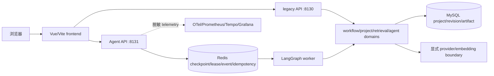

# Iteration 5 最终架构（Aspect 8 收口证据）

## 状态

本文是 Iteration 5 Aspect 8 的当前架构记录。`actual_topology_probe` 只表示进程、容器、端口和 readiness 探针；`deterministic_business_acceptance` 才表示固定历史 Acceptance dataset 的业务断言。两者不能互相替代。最终是否完成以 [`closeout.md`](../development/iteration-5/closeout.md) 的真实 gate 结果为准。

## 产品边界

Aspect 4 的后端 canonical domain graph 为 `app/serve → service domains → retrieval → infrastructure adapters`；旧 app/service/dao/llm/vectorstore/tools 路径仅作为兼容 façade 或稳定 shared resource 保留。Aspect 5 的前端 graph 为 `app/router → features → shared`，测试和 fixture 以 current/historical 责任区分。

## 数据职责

- MySQL 保存项目、revision、有效 artifact 和结构化业务记录。
- Redis 保存 checkpoint、租约、取消、事件和幂等状态；worker heartbeat 只表示运行可用性。
- `project_files` 保存受保护的上传项目；它不是验收 harness 的报告目录。
- Prometheus、Tempo、Grafana 和 OTel 只负责观测数据，不改变业务 artifact 的真源职责。

## 两种运行拓扑

### 模块化拓扑

模块化 runner 只管理 legacy API、Agent API、worker 和 frontend。MySQL/Redis 由外部或 task-owned disposable Compose project 提供，runner 只做只读预检；MCP 和观测组件不由默认 runner 自动发现或启动。状态与日志在系统临时目录的 runner-owned run 目录中。

### Docker 完整拓扑

默认 `compose.yaml` 继续包含 10 个服务、原有端口、application/observability 网络和六个 named volume。Aspect 8 使用唯一 task-owned project 和 task-owned 应用镜像 tag；不得接管已有 project、container、image、volume 或真实环境文件。固定宿主端口冲突时结果为 `Blocked`，不改端口也不停止占用者。

## 不变声明

19 个 workflow、22 个工具、legacy/Agent REST、SSE、MCP schema、artifact/revision/cache/RAG、预算、HITL、严格 JSON checkpoint、lease、幂等、恢复、审批和 MySQL/Redis 职责均由既有 contract/golden tests 保护。页面加载不触发隐式付费调用；approval bypass、重复副作用、跨项目泄漏和敏感泄漏必须为零。

## 版本、规范与运维入口

- 版本契约：[`docs/versions.md`](../versions.md)
- 工程规范：[`style-guide.md`](../development/iteration-5/style-guide.md)
- 模块化运行：[`modular-runtime.md`](../operations/modular-runtime.md)
- 容器交付：[`container-delivery.md`](../operations/container-delivery.md)
- 双模式验收：[`dual-mode-acceptance.md`](../operations/dual-mode-acceptance.md)
- Aspect 1–7 迁移记录：当前 Iteration 5 development log 与各 migration fixture

## 限制与回滚

宿主缺少既有 Python runtime package、固定 Docker 端口或本地 digest 镜像时，必须记录 `Blocked`，不得安装依赖、改端口、修改历史 hash 或接触用户数据。Aspect 8 的新增/修改文件从仓库外 backup 按 post-hash 条件回滚；`removed_paths` 保持为空。
