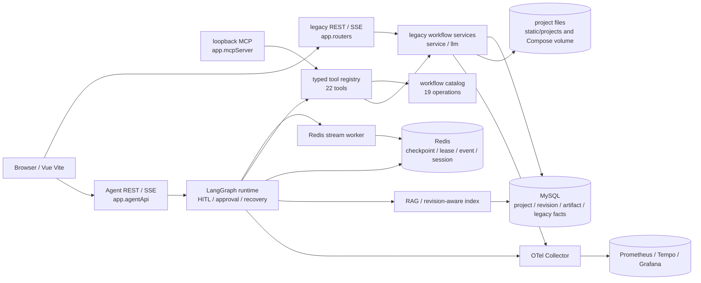

# Iteration 5 Aspect 1：只读基线与架构边界

状态：Aspect 1 基线资产由本回合冻结；本文件只记录当前工作树和 Iteration 4 保护边界，不升级依赖、不移动源码、不改写历史证据。

## Git 基线

本次快照使用本地 Git 元数据，不访问远程：

| 字段 | 值 |
|---|---|
| branch | `main` |
| HEAD | `8812be4fa73ab6274ec642fd5099be060aafb5d6` |
| local `origin/main` | `8812be4fa73ab6274ec642fd5099be060aafb5d6` |
| ahead/behind | `0 / 0` |
| staged | 无 |
| tracked dirty | `README.md`、`ez_back_dev/tests/test_iteration4_release_contracts.py` |
| untracked | `docs/iteration-5-overview.md`、`docs/iteration-5-prompts.md`、`ez_back_dev/tests/test_iteration5_planning_contracts.py` |

上述 dirty/untracked 内容均属于用户资产。Aspect 1 不恢复、不覆盖、不 stage、不 commit。

机器可校验的完整 hash 记录见 `ez_back_dev/tests/fixtures/iteration5_baseline_manifest_v1.json`；分类清单见 `ez_back_dev/tests/fixtures/iteration5_asset_inventory_v1.json` 和 `docs/iteration-5-asset-inventory.md`。

## Hash 规则

基线使用 `sha256_canonical_lf_v1`：

1. 文本按 UTF-8 读取，去除 BOM，统一 CRLF/CR 为 LF，末尾统一为一个 LF。
2. JSON 以排序 object key、保留 array 顺序、无额外空白的 canonical JSON 计算 hash。
3. 二进制资产使用原始字节 SHA-256。
4. dirty tracked 文件记录当前 worktree hash；受保护用户数据不读取、不记录大小、不计算 hash。
5. baseline fixture 中的值是人工审查快照，不由测试运行时从当前文件自动生成。

## 版本表面

| 表面 | 当前来源与基线 | 说明 |
|---|---|---|
| Python runtime | `ez_back_dev/Dockerfile`、Actions：Python 3.11.15 | 与 README 的 Python 3.11 说明对应 |
| Python direct dependencies | `requirements.txt`：FastAPI 0.141.1、Uvicorn 0.52.4、Pydantic 2.13.4、SQLAlchemy 2.0.52、LangGraph 1.2.11、Redis 6.4.0、OpenTelemetry 1.44.0、LangChain Core 1.5.6、OpenAI 3.3.0、pytest 9.1.1 等 | 当前没有 Python lock/constraints/hash 文件 |
| Node/npm runtime | `ez_front_dev/Dockerfile`、Actions：Node 24.18.0；README 记录 npm 11 | 不在 Aspect 1 选择包管理器或升级版本 |
| npm declarations | `package.json`：Vue、Element Plus、Axios、Vite、TypeScript、ESLint 等 | package.json 的范围和精确开发依赖均受保护 |
| npm resolution | `package-lock.json` lockfileVersion 3；当前解析包含 Vue 3.5.42、Element Plus 2.14.5、Vite 8.2.2、TypeScript 6.0.3 | lockfile 是当前 npm 可重复安装来源 |
| backend image | Python 3.11.15 slim digest | Dockerfile 中固定 digest |
| frontend images | Node 24.18.0 alpine、nginx 1.29 alpine digest | Dockerfile 中固定 digest |
| service images | Compose 中 MySQL 8.4、Redis 8.2.8、OTel Collector 0.159.0、Prometheus 3.12.0、Tempo 2.10.7、Grafana 13.1.3 digest | Compose 当前为 10 service 完整栈 |
| Compose application tags | `ezllmtest/backend:iteration4-aspect7`、`ezllmtest/frontend:iteration4-aspect7` | 作为 active delivery 表面保护，不能按名字静默改名 |
| GitHub Actions | `.github/workflows/iteration4-offline.yml`；checkout/setup-python/setup-node 使用固定 SHA；Redis 使用固定 digest | 当前只有一个 tracked CI workflow |
| SQL/schema | `ezllmtest.sql` dump header 为 MySQL 8.0.29；Compose 使用 MySQL 8.4 | 兼容性需后续单独核对，本回合不改 schema |
| runtime contracts | Agent graph、API、MCP、RAG、telemetry、acceptance 中的 `iteration4-aspect*` 和 schema/policy version | 其中部分是公共/内部契约标识，不是普通注释 |
| env surface | 根、frontend、Compose `.env.example` 只记录变量名和占位符 | 真实 `.env` 未读取 |

已记录的主要漂移是 README 的 Element Plus 2.7 文字与 lockfile 解析版本、早期文档的 Vue CLI5 叙述与当前 Vite、SQL dump 8.0.29 与 Compose 8.4，以及 `LANGGRAPH_STRICT_MSGPACK` 名称与严格 JSON checkpoint 实现之间的疑似不一致。本回合只记录，不修正。

## 当前架构图

## 当前目录职责

| 区域 | 当前职责 | Aspect 1 处理 |
|---|---|---|
| `ez_back_dev/app` | legacy/Agent/MCP/worker/quality-gate 入口和 REST/SSE 路由 | 只做入口引用审计 |
| `ez_back_dev/service` | workflow、Agent runtime、workbench、RAG、artifact、telemetry、legacy service | 视为 active product asset；不移动 |
| `ez_back_dev/llm` | provider、streaming、预算与模型 guard | 保护 provider 边界和预算语义 |
| `ez_back_dev/dao`、`model` | legacy 表、revision、artifact、持久化 | 保护 MySQL 数据职责和 schema |
| `ez_back_dev/tools`、`vectorstore` | legacy InfoType、文档加载、索引和 retrieval | 保护兼容入口和 revision key |
| `ez_front_dev/src` | router、state、composables、views、workspace、Agent 工作台、assets | 只做动态引用和 asset 审计 |
| `ez_back_dev/test`、`ez_back_dev/tests` | 旧测试根、现代契约/安全/Eval/Acceptance/fixture | 不合并、不重命名 |
| `docs` | Iteration 历史、closeout、计划、运行与架构说明 | 历史 evidence 只哈希和建链接 |
| `ops`、`scripts` | Compose/OTel 配置、credential/bundle/fixture 门禁 | 视为交付工具资产 |

## 两种当前启动方式

### 完整 Compose

当前 Compose 声明 frontend、legacy-api、agent-api、worker、mysql、redis、otel-collector、prometheus、tempo、grafana 共 10 个 service，带 application/observability network、healthcheck 和 six named volumes：

`mysql_data`、`redis_data`、`project_files`、`prometheus_data`、`tempo_data`、`grafana_data`。

本回合不执行 `docker compose up`、build、inspect、down 或 volume 操作。Compose 只作为静态配置和 hash 输入。

### 分模块入口

当前代码和 README 已提供 legacy API、Agent API、worker、frontend 的独立入口；loopback MCP 和观测组件是可选入口。模块顺序冻结为：

`MySQL → Redis → legacy API → Agent API → worker → frontend`。

本回合不连接 MySQL/Redis，不读取用户数据，不启动服务；只记录入口、端口、env 名称和依赖关系。

## 迁移约束

本文件只为后续结构治理提供事实，不实施后续 Aspect：

- 不改变 public import、CLI、REST/SSE route、MCP URI/schema、事件 envelope 和 frontend lazy route。
- 不改变 19 workflow、22 tool、artifact/revision/RAG/cache、budget、approval、retention、HITL、checkpoint、lease、idempotency、cancel 或 recovery。
- 不改变 MySQL/Redis 职责、SQL 字段、Compose volume 和项目文件路径。
- `FounctionalTest.vue`、legacy service、旧测试根、旧资产和 iteration/aspect version 先保留，直到引用、回滚、CI 和 runtime 证据完整。
- 历史文档和 fixture 不为新目录静默改写；未来如归档必须保留 hash 和链接映射。
- Aspect 1 不移动生产代码或历史文档，不改变任何 manifest，不选择新包管理器。
